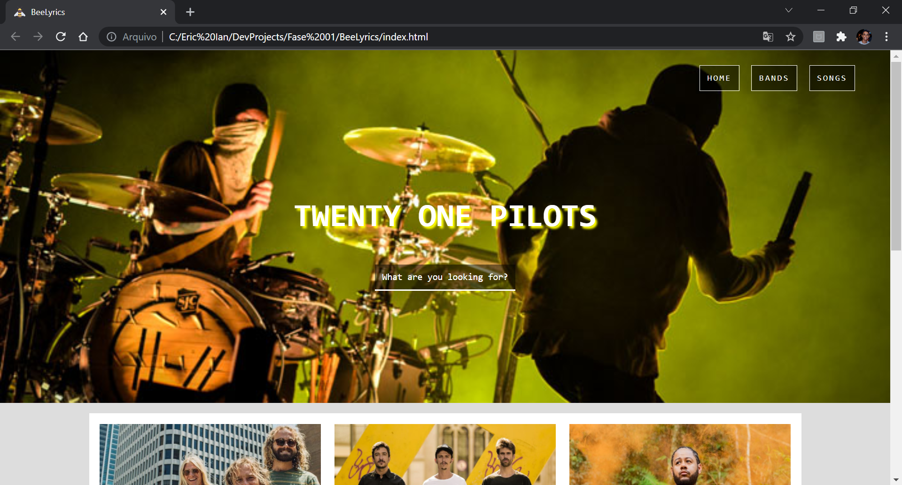
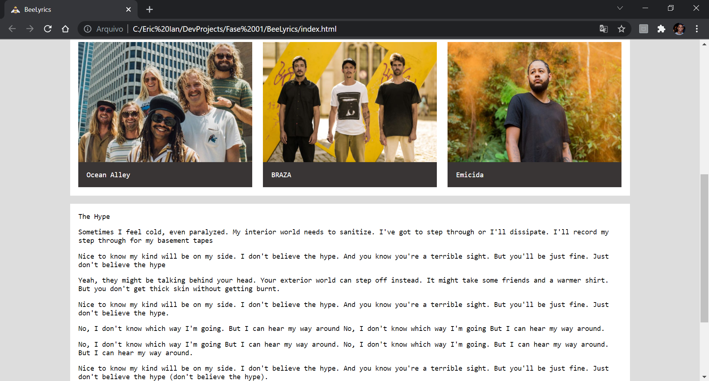

	

<h1 align="center">BeeLyrics</h1>

## Status

<h4 align="center"> 
	BeeLyrics - Finished! ✅
</h4>

## Description

This project is a mockup of a lyrics website. On Beelyrics, users would search for their favorite music and bands.

## Content

- [Description](#description)
- [Status](#status)
- [Content](#content)
- [How to use it?](#how-to-use-it)
- [Stack and Technoloy](#stack-and-technology)
- [ApplicationPhotos](#application-photos)

## How to use it?

Beelyrics is a simple mockup made with HTML and CSS. In this sense, it is possible to access the page directly through the HMTL file, being only necessary to keep the organization of the files.

## Stack and Technology

- HMTL
- CSS 

## Application Photos

